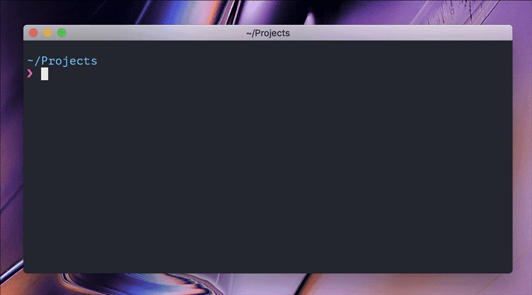

# create-ink-app [](https://github.com/vadimdemedes/create-ink-app/actions)

> Generate a starter [Ink](https://github.com/vadimdemedes/ink) app

## Usage

This helper tool scaffolds out basic project structure for Ink apps and lets you avoid the boilerplate and get to building beautiful CLIs in no time.

```bash
$ mkdir my-fancy-cli
$ cd my-fancy-cli
$ npx create-ink-app
# Or create with TypeScript React
$ npx create-ink-app --typescript
```



## Notes when contributing

**Use npm to install dependencies of create-ink-app**.
Installing with [pnpm](https://pnpm.io) or [Yarn](https://yarnpkg.com/) may create issues with linting, etc.
